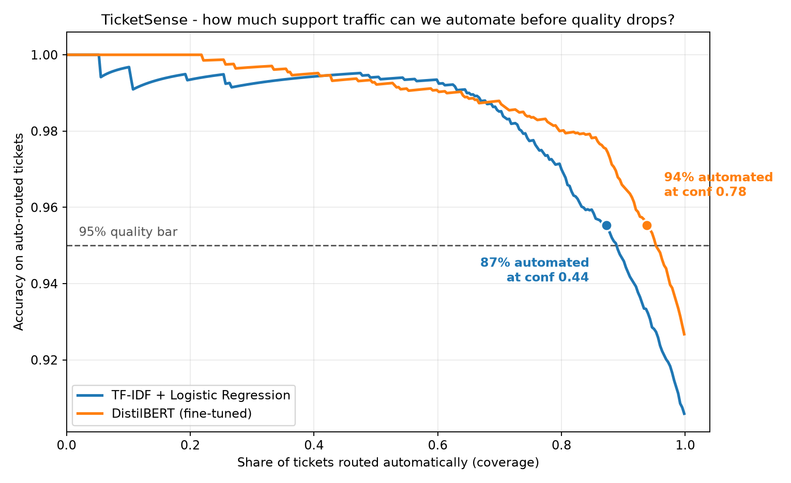

# TicketSense

Customer support intent classification on [BANKING77](https://arxiv.org/abs/2003.04807) — 77 banking intents, routed automatically when the model is confident and handed to a human when it is not.

The interesting question here is not "what accuracy can we get". It is **how much support traffic can we safely automate**, and the whole project is built around answering that with a number you could defend in a planning meeting.



## Results

Both models are evaluated on the **official BANKING77 test split**, which is never touched during training, tuning or threshold selection.

| | TF-IDF + LogReg | DistilBERT (fine-tuned) |
|---|---|---|
| Accuracy | 0.9051 | **0.9256** |
| Macro F1 | 0.9050 | **0.9255** |
| Weighted F1 | 0.9050 | **0.9256** |
| Worst per-class recall | 0.63 (`virtual_card_not_working`) | 0.69 (`pending_transfer`) |
| Confidence threshold | 0.442 | 0.783 |
| **Auto-routed at ≥95% accuracy** | **87.3%** of tickets | **93.8%** of tickets |
| Training time | 29 s (CPU) | 210 s (RTX 4060) |

DistilBERT is worth **+2.1 points of macro F1** — but the number that actually matters to a support team is the last row. At the same 95% quality bar, the manual-review queue shrinks from 12.7% of tickets to 6.2%: **about half the human review load disappears**.

## How the threshold is chosen

A classifier that is 92% accurate is not something you let loose on customer tickets unsupervised. Instead, every prediction carries a confidence, and anything below a threshold goes to a human.

Picking that threshold by eye defeats the point, so it is derived:

1. Sort validation predictions by confidence, descending.
2. The running mean of `correct` is then exactly *"accuracy if we auto-route the k most confident tickets"* — the full risk–coverage curve, with no threshold grid to guess at (`src/evaluate.py:risk_coverage`).
3. Take the **lowest** confidence bar that still holds 95% accuracy on what gets auto-routed. Lowest, not highest — the goal is to automate as much as possible *subject to* the quality bar, and the most confident single ticket is trivially 100% accurate.
4. Re-apply the chosen threshold with `>=` before reporting, so confidence ties at the cut are counted the way the API will actually count them.

The threshold is selected on validation and *reported* on test. It held up out of sample: 95.0% on validation → 95.5% on test for both models.

The API reads its threshold from the `metrics.json` that evaluation writes next to the model, so what gets served can never drift from what was measured. Serving a model that has no evaluation is a startup error, not a silent default.

## Error analysis

The residual errors are not noise — they are intent pairs that are genuinely close in meaning:

| True intent | Predicted as | Count |
|---|---|---|
| `why_verify_identity` | `verify_my_identity` | 7 |
| `pending_transfer` | `transfer_not_received_by_recipient` | 5 |
| `declined_transfer` | `declined_card_payment` | 4 |
| `card_delivery_estimate` | `card_arrival` | 4 |
| `card_arrival` | `card_delivery_estimate` | 4 |

"Why do I need to verify my identity?" and "How do I verify my identity?" are different intents with near-identical vocabulary, and `card_arrival`/`card_delivery_estimate` are confused symmetrically in both directions. These are label-design problems as much as model problems — the honest fix is merging or re-scoping the intents, not more epochs.

Full artifacts in [`reports/`](reports/): per-class recall, the complete 77×77 confusion matrix, top confusions, and the risk–coverage curve for each model.

## API

```bash
uvicorn api:app --app-dir src
# defaults to models/distilbert-v1; override with TICKETSENSE_MODEL
```

```bash
curl -X POST localhost:8000/predict -H "Content-Type: application/json" \
  -d '{"text":"My card still has not arrived, it has been two weeks"}'
```

```json
{
  "intent": "card_arrival",
  "confidence": 0.9939,
  "needs_review": false,
  "alternatives": [
    {"intent": "transfer_not_received_by_recipient", "confidence": 0.0028},
    {"intent": "card_delivery_estimate", "confidence": 0.0007}
  ]
}
```

A vague ticket falls below the bar and is queued for a human instead:

```json
{
  "intent": "cash_withdrawal_not_recognised",
  "confidence": 0.7145,
  "needs_review": true,
  "alternatives": [...]
}
```

| Endpoint | Purpose |
|---|---|
| `GET /health` | Model version, backend, threshold, expected coverage/accuracy |
| `POST /predict` | One ticket |
| `POST /predict/batch` | Up to 256 tickets in one call |

## Repository

```
src/data.py            BANKING77 loading + the stratified train/val split everything shares
src/models.py          One predict_proba interface over both model families
src/train_baseline.py  TF-IDF (char n-grams) + logistic regression
src/train_bert.py      DistilBERT fine-tune; model and tokenizer saved together
src/evaluate.py        Batch evaluation, confusion analysis, threshold selection, chart
src/api.py             FastAPI service with the manual-review fallback
test_ticketsense.py    Self-checks for the threshold logic
reports/               Metrics, per-class recall, confusion matrices, risk-coverage curve
```

## Reproduce

```bash
pip install -r requirements.txt
# for GPU training:
# pip install torch --index-url https://download.pytorch.org/whl/cu126

python test_ticketsense.py

cd src
python train_baseline.py && python evaluate.py --name baseline   --model-dir ../models/baseline-v1
python train_bert.py     && python evaluate.py --name distilbert --model-dir ../models/distilbert-v1
```

Models are gitignored (257 MB for the fine-tune); the two training scripts rebuild them from scratch in under four minutes on a laptop GPU.

## Notes and limitations

- **Data source.** The original `PolyAI/banking77` repo still ships a loading script, which `datasets>=4` refuses to execute. This uses the `mteb/banking77` mirror: same corpus with a few exact duplicates removed (9,993 train / 3,076 test vs the 10,003 / 3,080 in the paper), so numbers are close to but not bit-identical with published results.
- **Validation split.** 20% stratified out of train, seed 42. ~26 validation examples per intent — thin enough that the threshold has real variance on it, which is why it is reported on test as well.
- **Confidence is uncalibrated.** Softmax max is a usable ranking signal and the risk–coverage curve is valid regardless, but the raw numbers are not probabilities. Temperature scaling on the validation split would be the next step if the threshold needed to mean something absolute.
- **Not tuned hard.** No hyperparameter search, no ensembling, no class rebalancing. DistilBERT plateaued at epoch 7 of 10 and the best checkpoint is kept, not the last.
